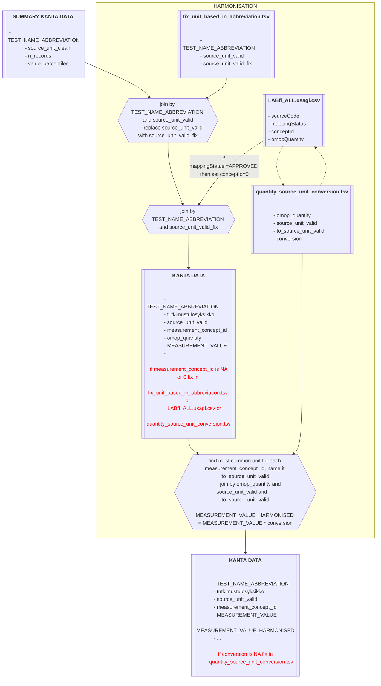

```mermaid
graph TD


    summary_data[[
        <b>SUMMARY KANTA DATA</b> 
        <p style="text-align:left;" > - TEST_NAME_ABBREVIATION
            - source_unit_clean	
            - n_records	
            - value_percentiles 
        </p>
    ]]

    do_abbr_unit_cleaning{{
        join by TEST_NAME_ABBREVIATION and source_unit_valid
        replace source_unit_valid with source_unit_valid_fix
    }}

    abbr_unit_fix[[
        <b>fix_unit_based_in_abbreviation.tsv</b>
        <p style="text-align:left;" >
            - TEST_NAME_ABBREVIATION
            - source_unit_valid
            - source_unit_valid_fix
        </p>
    ]]

    do_abbr_unit_mapping{{join by TEST_NAME_ABBREVIATION and source_unit_valid_fix}}

    lab_usagi_table[[
        <b>LABfi_ALL.usagi.csv</b>
        <p style="text-align:left;" >
            - sourceCode
            - mappingStatus
            - conceptId
            - omopQuantity
        </p>
    ]]

    mapped[[
        <b>KANTA DATA</b>
        <p style="text-align:left;" >
            - TEST_NAME_ABBREVIATION
            - tutkimustulosyksikko
            - source_unit_valid
            - measurement_concept_id
            - omop_quantity
            - MEASUREMENT_VALUE
            - ...
        </p><p style="color:red;"> if measurement_concept_id is NA or 0 fix in 
        fix_unit_based_in_abbreviation.tsv or 
        LABfi_ALL.usagi.csv or
        quantity_source_unit_conversion.tsv
        </p>
    ]]

    do_value_harmonisation{{
        find most common unit for each measurement_concept_id, name it to_source_unit_valid
        join by omop_quantity and source_unit_valid and	to_source_unit_valid
        MEASUREMENT_VALUE_HARMONISED = MEASUREMENT_VALUE * conversion
        }}

    value_harmonisation_table[[
        <b>quantity_source_unit_conversion.tsv</b>
        <p style="text-align:left;" >
            - omop_quantity
            - source_unit_valid
            - to_source_unit_valid
            - conversion
        </p>
    ]]

    harmonised_values[[
        <b>KANTA DATA</b>
        <p style="text-align:left;" >
            - TEST_NAME_ABBREVIATION
            - tutkimustulosyksikko
            - source_unit_valid
            - measurement_concept_id
            - MEASUREMENT_VALUE
            - MEASUREMENT_VALUE_HARMONISED
            - ...
        </p><p style="color:red;"> if conversion is NA fix in 
        quantity_source_unit_conversion.tsv
        </p>
    ]]


    summary_data --> do_abbr_unit_cleaning 
    
    subgraph HARMONISATION
        abbr_unit_fix --> do_abbr_unit_cleaning 
        do_abbr_unit_cleaning --> do_abbr_unit_mapping 
        lab_usagi_table -.-> value_harmonisation_table -.-> lab_usagi_table 
        lab_usagi_table -- if mappingStatus!=APPROVED then set conceptId=0 --> do_abbr_unit_mapping
        do_abbr_unit_mapping --> mapped
        mapped --> do_value_harmonisation
        value_harmonisation_table --> do_value_harmonisation
    end

    do_value_harmonisation --> harmonised_values
    
```

