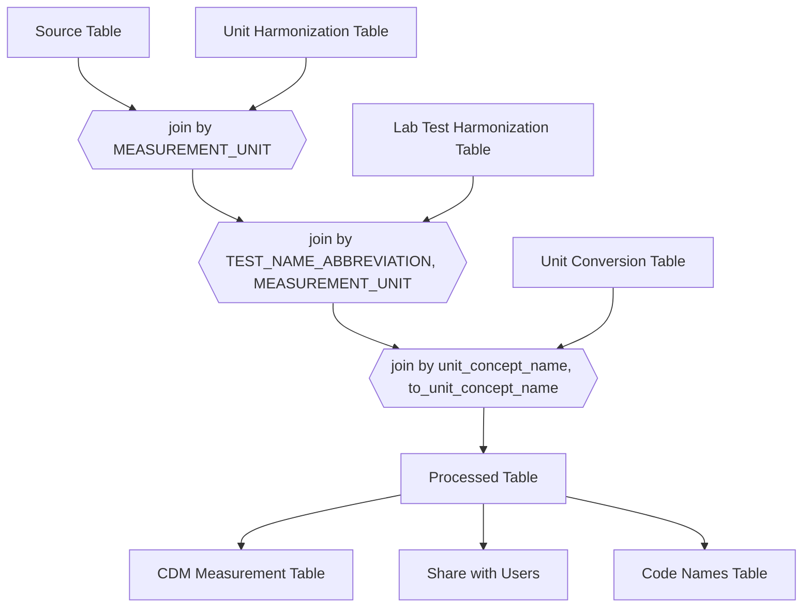

#  processed Table Format

| Column Name               | Type     | Example                                 | Value source                                                                       | >   | Share with Users                               | CDM Target                                                                                              |
| ------------------------- | -------- | --------------------------------------- | ---------------------------------------------------------------------------------- | --- | ---------------------------------------------- | ------------------------------------------------------------------------------------------------------- |
| rowid                     | int      |                                         | from row number in `source`.                                                       |     | Y                                              | plus offset to `measurement`.`measurement_id`                                                           |
| FINNGENID                 | varchar  |                                         | from `source`.`hetu_root`                                                          |     | Y                                              | to `measurement`.`person_id` from  `person`.`person_id` where `person`.`person_source_id` = FINNGENID   |
| MEASUREMENT_DATE_TIME     | datetime |                                         | from `source`.`tutkimusaika`                                                       |     | Y                                              | to `measurement`.`measurement_date`, `measurement`.`measurement_date`, `measurement`.`measurement_time` |
| SERVICE_PROVIDER          | varchar  |                                         | from `source`.`palvelutuottaja_organisaatio`                                       |     | Y                                              |                                                                                                         |
| service_provider_name     | varchar  |                                         | ?                                                                                  |     | in Names table join to  SERVICE_PROVIDER       | to `measurement`.`provider_id` ?                                                                        |
| TEST_NAME_ABBREVIATION    | varchar  | sy-leuk                                 | from `source`.`paikallinentutkimusnimike`                                          |     | Y                                              | to `measurement`.`measurement_source_value`                                                             |
| TEST_ID                   | int      | 1103080                                 | from `source`.`paikallinentutkimusnimikeid`,`source`.`laboratoriotutkimusnimikeid` |     | Y                                              |                                                                                                         |
| MEASUREMENT_UNIT          | varchar  | e6/l                                    | from `source`.`tutkimustulosyksikko`                                               |     | Y                                              | to `measurement`.`measurement_unit_value`                                                               |
| unit_concept_name         | varchar  | 10*6/L                                  | from `unit_harmonization`.`unit_concept_name`                                      |     | Y                                              |                                                                                                         |
| unit_concept_id           | int      | 9442                                    | from `unit_harmonization`.`unit_concept_id`                                        |     | N                                              | to `measurement`.`measurement_unit_concept_id`                                                          |
| name_fi  ?                | varchar  |                                         | from `lab_test_harmonization`.`name_fi`                                            |     | in Names table join to TEST_NAME_ABBREVIATION  |                                                                                                         |
| measurement_concept_id    | int      | 3000475                                 | from `lab_test_harmonization`.`measurement_concept_id`                             |     | Y                                              | to `measurement`.`measurement_concept_id`                                                               |
| measurement_concept_name  | varchar  | Leukocytes [#/volume] in Synovial fluid | from `lab_test_harmonization`.`measurement_concept_name`                           |     | in Names table  join to measurement_concept_id |                                                                                                         |
| MEASUREMENT_VALUE         | float    | 120                                     | from `source`.`tutkimustulosarvo`                                                  |     | Y                                              | to `measurement`.`value_source_value`                                                                   |
| to_unit_concept_name      | varchar  | 10*9/L                                  | from group by measurement_concept_id pick the most common unit_concept_name        |     | Y                                              |                                                                                                         |
| conversion_factor         | float    | 0.001                                   | from `unit_conversion`.`conversion_factor`                                         |     | Y                                              |                                                                                                         |
| converted_value           | float    | 0.12                                    | `converted_value` *  `conversion_factor`                                           |     | Y                                              | to `measurement`.`value_as_number`                                                                      |
| RESULT_ABNORMALITY        |          |                                         | from `source`.`tuloksenpoikkeavuus`                                                |     | Y                                              | to `measurement`.`value_as_concept_id`                                                                  |
| MEASUREMENT_STATUS        |          |                                         | from `source`.`tutkimusvastauksentila`                                             |     | Y                                              |                                                                                                         |
| TEST_REFERENCE_VALUE_TEXT | varchar  |                                         | from `source`.`viitevaliteksti`                                                    |     | Y                                              |                                                                                                         |
| reference_high_value      | float    |                                         | parsed from TEST_REFERENCE_VALUE_TEXT        ?                                     |     | Y                                              | to `measurement`.`range_high`                                                                           |
| reference_low_value       | float    |                                         | parsed from TEST_REFERENCE_VALUE_TEXT        ?                                     |     | Y                                              | to `measurement`.`range_low`                                                                            |

 # `unit_harmonization` Table Format

| Column Name       | Type    | Example |
| ----------------- | ------- | ------- |
| MEASUREMENT_UNIT  | varchar | e6/l    |
| unit_concept_name | varchar | 10*6/L  |
| unit_concept_id   | int     | 9442    |

 # `lab_test_harmonization` Table Format

| Column Name              | Type    | Example                                 | Comments                                             |
| ------------------------ | ------- | --------------------------------------- | ---------------------------------------------------- |
| TEST_NAME_ABBREVIATION   | varchar | sy-leuk                                 |                                                      |
| unit_concept_name        | varchar | 10*6/L                                  |                                                      |
| name_fi                  | varchar |                                         | not sure if needed , bcs it is not for abbreviation? |
| measurement_concept_id   | int     | 3000475                                 |                                                      |
| measurement_concept_name | varchar | Leukocytes [#/volume] in Synovial fluid |                                                      |

# `unit_conversion` Table Format

| Column Name          | Type    | Example |
| -------------------- | ------- | ------- |
| unit_concept_name    | varchar | 10*6/L  |
| to_unit_concept_name | varchar | 10*9/L  |
| conversion_factor    | float   | 0.001   |

# `names` Table Format

| Column Name | Type    | Example                                 |
| ----------- | ------- | --------------------------------------- |
| column      | varchar | measurement_concept_id                  |
| id          | varchar | 3000475                                 |
| name        | varchar | Leukocytes [#/volume] in Synovial fluid |

# Processed Table Format

| Column in raw file                                      | Column in clean file      | Comment |
| ------------------------------------------------------- | ------------------------- | ------- |
| potilashenkilotunnus                                    | FINREGISTRYID             |         |
| tutkimusaika                                            | MEASUREMENT_DATE_TIME     |         |
| palveluntuottaja_organisaatio                           | SERVICE_PROVIDER          |         |
| paikallinentutkimusnimikeid,laboratoriotutkimusnimikeid | TEST_ID                   |         |
| paikallinentutkimusnimikeid,laboratoriotutkimusnimikeid | TEST_ID_SOURCE            |         |
| paikallinentutkimusnimike (ONLY IF LOCAL)               | TEST_NAME_ABBREVIATION    |         |
| tutkimustulosarvo                                       | MEASUREMENT_VALUE         |         |
| tutkimustulosyksikko                                    | MEASUREMENT_UNIT          |         |
| tuloksenpoikkeavuus                                     | RESULT_ABNORMALITY        |         |
| viitevaliteksti                                         | TEST_REFERENCE_VALUE_TEXT |         |
| tutkimusvastauksentila                                  | MEASUREMENT_STATUS        |         |

 # `source` Table Format

| Original                        | Translation                         |
| ------------------------------- | ----------------------------------- |
| laboratoriotutkimusnimikeid     | LAB_MEASUREMENT_NAME_ID             |
| asiakirjaoid                    | DOCUMENT_ID                         |
| merkintaoid                     | NOTE_ID                             |
| entryoid                        | ENTRY_ID                            |
| potilashenkilotunnus            | FINNREGISTRYID                      |
| palvelutapahtumatunnus          | SERVICE_EVENT_ID                    |
| tutkimuksennaytelaatupk         | MEASUREMENT_TYPE                    |
| tutkimuksentekotapapk           | MEASUREMENT_METHOD                  |
| potilassyntymaaika_pvm          | BIRTH_DATE                          |
| potilas_sukupuolipk             | SEX                                 |
| laboratoriotutkimusoid          | LAB_RESULT_ID                       |
| tutkimusaika                    | MEASUREMENT_DATE_TIME               |
| alkuperainenasiakirjaoid        | PRIMARY_DOCUMENT_OID                |
| asiakirjaversio                 | DOCUMENT_VERSION                    |
| rekisterinpitaja_organisaatio_h | REGISTRY_CONTROLLER_ORGANISATION_ID |
| rekisterinpitaja_h              | REGISTRY_CONTROLLER_ID              |
| asiakirjavalmistilapk           | DOCUMENT_STATUS code form           |
| maarittelykokoelmaoid           |                                     |
| tietojarjestelmanimi            |                                     |
| tietojarjestelmavalmistaja      |                                     |
| tietojarjestelmaversio          |                                     |
| asiakirjaluontiaika             | DOCUMENT_TIME                       |
| pal_alkuperainenasiakirjaoid    |                                     |
| pal_asiakirjaversio             |                                     |
| pal_asiakirjaoid                |                                     |
| pal_asiakirjaluontiaika         |                                     |
| rekisterinpitaja_organisaatio   | REGISTRY_CONTROLLER_ORGANISATION_ID |
| rekisterinpitaja                | REGISTRY_CONTROLLER_ID              |
| palvelutuottaja_organisaatio    | SERVICE_PROVIDER_ID                 |
| palveluisanta_organisaatio      | SERVICE_HOST_ID                     |
| hetu_root                       |                                     |
| paikallinentutkimusnimike       | LOCAL_TEST_NAME                     |
| paikallinentutkimusnimikeid     | LOCAL_TEST_ID                       |
| tutkimuskoodistonjarjestelmaid  | CODING_SYSTEM_ID                    |
| tutkimusvastauksentila          | MEASUREMENT_STATUS                  |
| tutkimustulosarvo               | MEASUREMENT_VALUE                   |
| tutkimustulosyksikko            | MEASUREMENT_UNIT                    |
| tuloksenpoikkeavuus             | RESULT_ABNORMALITY                  |
| tuloksenvalmistumisaika         | RESULT_COMPLETION_TIME              |
| viitearvoryhma                  |                                     |
| viitevalialkuarvo               | TEST_REFERENCE_START_VALUE          |
| viitevalialkuyksikko            | TEST_REFERENCE_START_VALUE_UNIT     |
| viitevaliloppuarvo              | TEST_REFERENCE_END_VALUE            |
| viitevaliloppuyksikko           | TEST_REFERENCE_END_VALUE_UNIT       |
| viitevaliteksti                 | TEST_REFERENCE_VALUE_TEXT           |
| erikoisalalyhenne               | SPECIALTY_ABBREVIATION              |

# CDM Measurement Table Format

| CDM Field                     |
| ----------------------------- |
| measurement_id                |
| person_id                     |
| measurement_concept_id        |
| measurement_date              |
| measurement_datetime          |
| measurement_time              |
| measurement_type_concept_id   |
| operator_concept_id           |
| value_as_number               |
| value_as_concept_id           |
| unit_concept_id               |
| range_low                     |
| range_high                    |
| provider_id                   |
| visit_occurrence_id           |
| visit_detail_id               |
| measurement_source_value      |
| measurement_source_concept_id |
| unit_source_value             |
| unit_source_concept_id        |
| value_source_value            |
| measurement_event_id          |
| meas_event_field_concept_id   |
*
