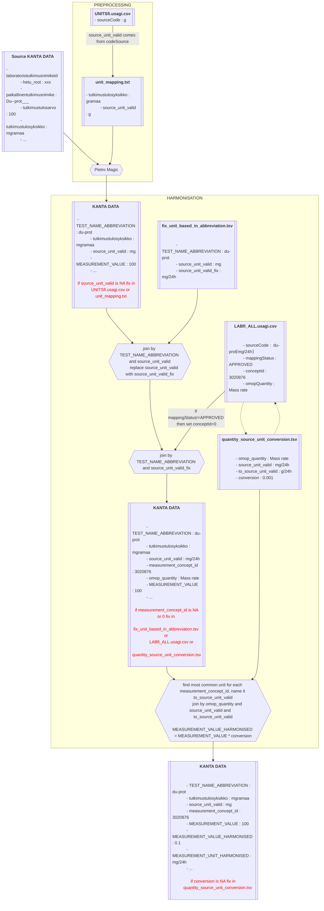

```mermaid
graph TD

    raw[[
        <b>Source KANTA DATA</b>
        <p style="text-align:left;" >- laboratoriotutkimusnimikeid
            - hetu_root : xxx
            - paikallinentutkimusnimike : Du--prot___
            - tutkimustulosarvo : 100
            - tutkimustulosyksikko : mgramaa
            - ...
        </p>
    ]]

    units_usage_table[[
        <b>UNITSfi.usagi.csv</b>
        <p style="text-align:left;" >- sourceCode : g</p>
    ]]

    unit_harmonisation_table[[
        <b>unit_mapping.txt</b>
        <p style="text-align:left;" >- tutkimustulosyksikko : gramaa
            - source_unit_valid : g
        </p>
    ]]

    do_cleaning{{Pietro Magic}} 

    cleaned[[
        <b>KANTA DATA</b> 
        <p style="text-align:left;" > - TEST_NAME_ABBREVIATION : du-prot
            - tutkimustulosyksikko : mgramaa 
            - source_unit_valid : mg
            - MEASUREMENT_VALUE : 100
            - ...
        </p><p style="color:red;"> if source_unit_valid is NA fix in 
        UNITSfi.usagi.csv or 
        unit_mapping.txt
        </p>
        
    ]]

    do_abbr_unit_cleaning{{
        join by TEST_NAME_ABBREVIATION and source_unit_valid
        replace source_unit_valid with source_unit_valid_fix
    }}

    abbr_unit_fix[[
        <b>fix_unit_based_in_abbreviation.tsv</b>
        <p style="text-align:left;" >
            - TEST_NAME_ABBREVIATION : du-prot
            - source_unit_valid : mg
            - source_unit_valid_fix : mg/24h
        </p>
    ]]

    do_abbr_unit_mapping{{join by TEST_NAME_ABBREVIATION and source_unit_valid_fix}}

    lab_usagi_table[[
        <b>LABfi_ALL.usagi.csv</b>
        <p style="text-align:left;" >
            - sourceCode :  du-prot⌈mg/24h⌉
            - mappingStatus : APPROVED
            - conceptId : 3020876
            - omopQuantity : Mass rate
        </p>
    ]]

    mapped[[
        <b>KANTA DATA</b>
        <p style="text-align:left;" >
            - TEST_NAME_ABBREVIATION : du-prot
            - tutkimustulosyksikko : mgramaa
            - source_unit_valid : mg/24h
            - measurement_concept_id : 3020876
            - omop_quantity : Mass rate
            - MEASUREMENT_VALUE : 100
            - ...
        </p><p style="color:red;"> if measurement_concept_id is NA or 0 fix in 
        fix_unit_based_in_abbreviation.tsv or 
        LABfi_ALL.usagi.csv or
        quantity_source_unit_conversion.tsv
        </p>
    ]]

    do_value_harmonisation{{
        find most common unit for each measurement_concept_id, name it to_source_unit_valid
        join by omop_quantity and source_unit_valid and	to_source_unit_valid
        MEASUREMENT_VALUE_HARMONISED = MEASUREMENT_VALUE * conversion
        }}

    value_harmonisation_table[[
        <b>quantity_source_unit_conversion.tsv</b>
        <p style="text-align:left;" >
            - omop_quantity : Mass rate
            - source_unit_valid : mg/24h
            - to_source_unit_valid : g/24h
            - conversion : 0.001
        </p>
    ]]

    harmonised_values[[
        <b>KANTA DATA</b>
        <p style="text-align:left;" >
            - TEST_NAME_ABBREVIATION : du-prot
            - tutkimustulosyksikko : mgramaa
            - source_unit_valid : mg
            - measurement_concept_id : 3020876
            - MEASUREMENT_VALUE : 100
            - MEASUREMENT_VALUE_HARMONISED : 0.1
            - MEASUREMENT_UNIT_HARMONISED : mg/24h
            - ...
        </p><p style="color:red;"> if conversion is NA fix in 
        quantity_source_unit_conversion.tsv
        </p>
    ]]


    raw --> do_cleaning

    subgraph PREPROCESSING
        units_usage_table -- source_unit_valid comes from codeSource--> unit_harmonisation_table
        unit_harmonisation_table --> do_cleaning
    end

    do_cleaning --> cleaned 
    
    subgraph HARMONISATION
        cleaned --> do_abbr_unit_cleaning
        abbr_unit_fix --> do_abbr_unit_cleaning 
        do_abbr_unit_cleaning --> do_abbr_unit_mapping 
        lab_usagi_table -.-> value_harmonisation_table -.-> lab_usagi_table 
        lab_usagi_table -- if mappingStatus!=APPROVED then set conceptId=0 --> do_abbr_unit_mapping
        do_abbr_unit_mapping --> mapped
        mapped --> do_value_harmonisation
        value_harmonisation_table --> do_value_harmonisation
    end

    do_value_harmonisation --> harmonised_values
    
```

